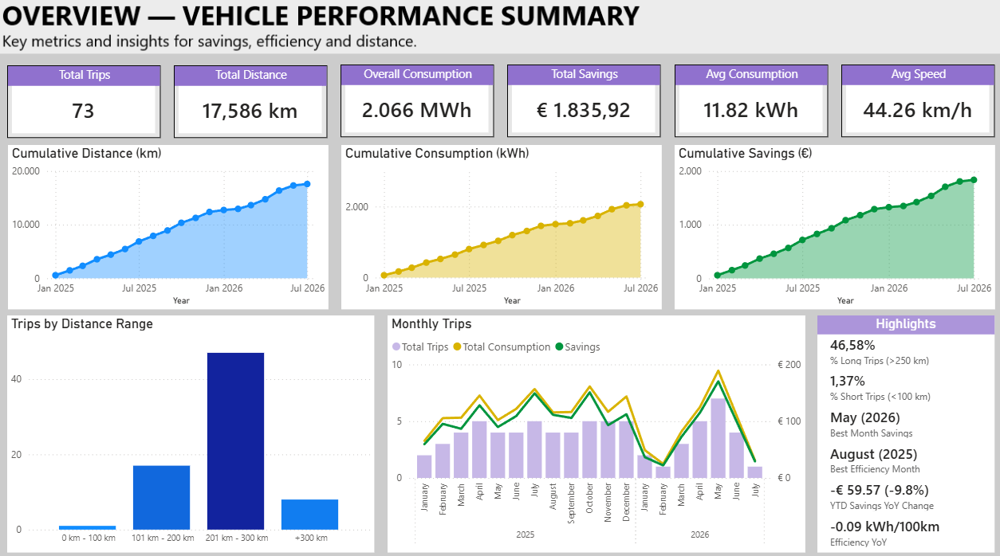
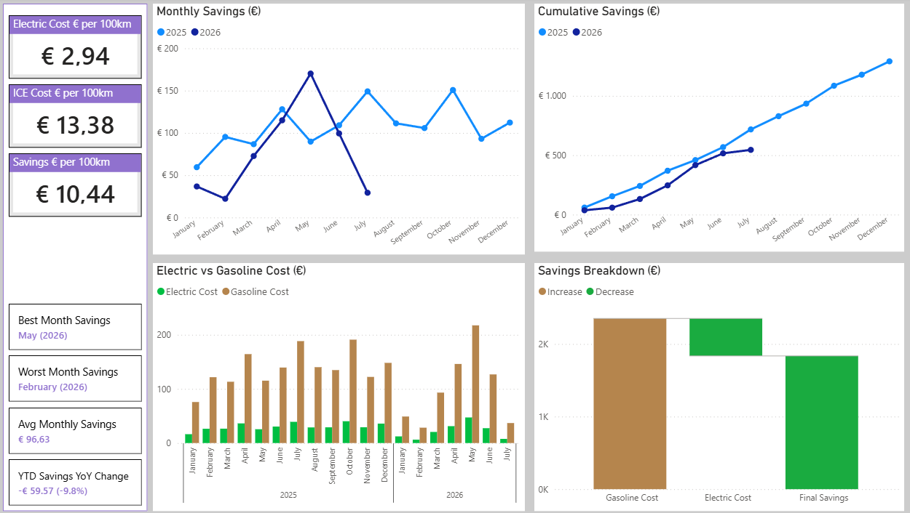
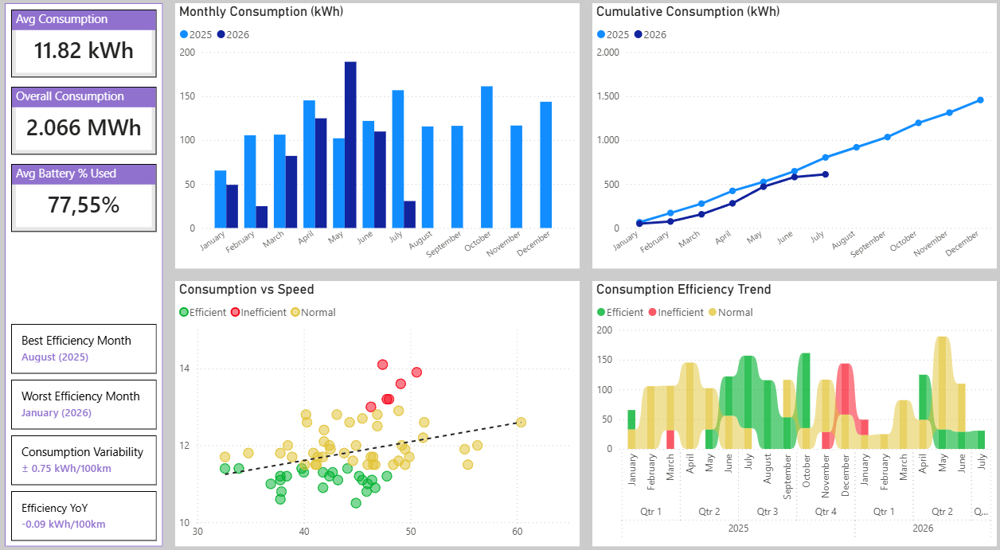
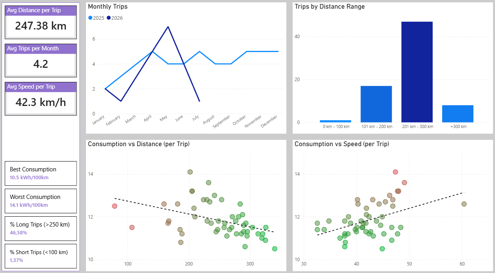

<h1 align="left">
  
  # EV Analytics Dashboard
</h1>  


**Excel → SQL Server → Power BI**

A complete analytics pipeline designed to evaluate the efficiency, energy consumption and cost performance of an electric vehicle (EV).  
This project integrates raw trip data, SQL Server transformations and a Power BI dashboard to deliver actionable insights. For a detailed explanation of the data model, ETL pipeline and full project architecture, please refer to the User Guide included in this repository.


## 🧰 Technologies Used
- **Excel** — raw data collection & parameter inputs  
- **SQL Server** — ETL (raw → staging → enriched view), data cleaning, transformations  
- **Power BI** — data modeling, DAX measures, KPIs, dashboards  

## 📊 Key Features
- EV consumption and efficiency analysis  
- Estimated range calculation  
- EV vs ICE cost comparison  
- Monthly and cumulative consumption trends  
- Efficiency categorization (Efficient / Normal / Inefficient)  
- Speed vs consumption scatter analysis  
- Battery usage and savings metrics  

## 📁 Repository Structure
```
ev-analytics-dashboard/
│
├── Excel/
│   ├── parameters.csv
│   ├── trip_reports_raw.csv
│
├── SQL/
│   ├── CreationCodex.sql
│   ├── refresh_data.sql
│
├── PowerBI/
│   ├── EV Insights & Performance Analytics.pbix
│
└── EV Analytics Dashboard UserGuide v1.0.pdf
│
└── README.md 
```
## How to Use
- **Excel** — Insert or update raw trip data and vehicle parameters.
- **SQL Server** — Run the scripts to clean, transform and load the data into the EV_Analytics database.
- **Power BI** — Refresh the data model to generate updated KPIs and visual insights.

### User Guide (Manual Completo)
Para instruções detalhadas de instalação, configuração e utilização do projeto, consulte o manual completo:
[EV Analytics Dashboard UserGuide v1.0.pdf](EV%20Analytics%20Dashboard%20UserGuide%20v1.0.pdf)


## 📝 Notes
- Real personal data was removed or replaced with sample values.  
- The Power BI file may be replaced with screenshots if needed.

## 📊 Dashboard Preview

### 1. Overview — Vehicle Performance Summary


### 2. Cost Comparison — EV vs ICE


### 3. Consumption & Efficiency Analysis


### 4. Trip Analysis — Distance & Driving Behavior



## 📬 Contact
If you want to discuss the project or ask questions:  
**André Marques** — andregmfour@gmail.com
